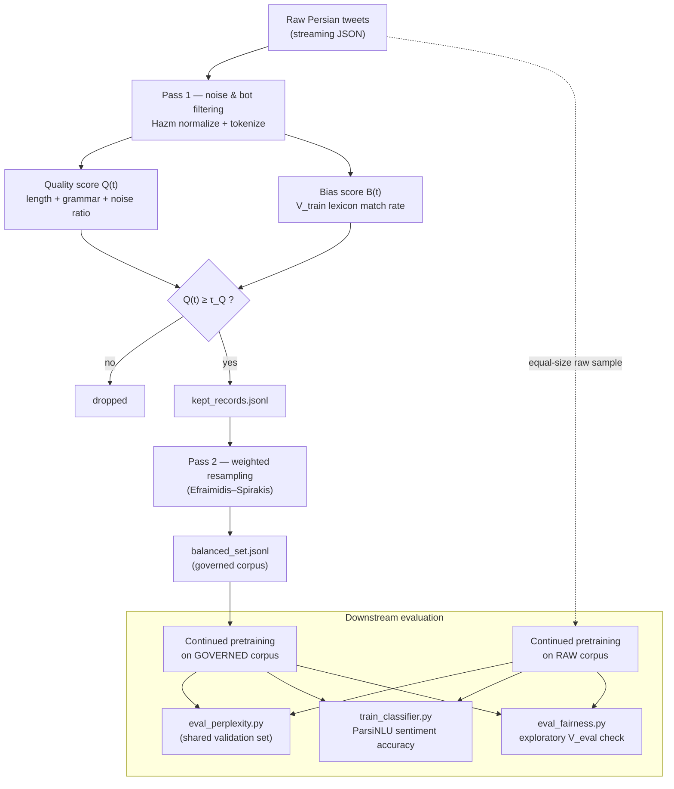

# Persian Twitter Data Governance Framework

Reference implementation of a data governance pipeline for cleaning, scoring, and de-biasing Persian-language Twitter data used to train large language models. It computes a per-tweet quality score $Q(t)$ and a lexical bias index $B(t)$, then produces a balanced corpus via weighted resampling. This repository accompanies the paper *"Quality and Bias Assessment of Social Media Data for Training Persian Large Language Models: A Data Governance Framework"* (Journal of Computing Sciences and Information Technology, Computer Society of Iran).

A public, anonymized sample of the pipeline's final output (8,000 records) is released separately on Zenodo; the DOI will be added here once published. **Raw Twitter data is not distributed in this repository** (privacy and data-ownership considerations).

## Architecture



## Repository layout

```
pipeline.py                  Main pipeline: noise cleaning, Q(t)/B(t) scoring, bias mitigation
bias_lexicon.csv              Bias lexicon V_bias (69 terms, 5 categories)
baseline_comparison.py        Regex vs. Hazm vs. Parsivar comparison under the same Q(t)/B(t) formula
param_sensitivity.py          Sensitivity analysis over L_max and (alpha, beta, gamma)
make_figures.py               Plots generated directly from pipeline.py's real output
export_public_sample.py       Exports the anonymized public sample
pass2_hard_filter.py          Alternative experiment: hard-exclude bias-flagged records instead of reweighting them
downstream/                   Downstream evaluation (perplexity, sentiment accuracy) on two continually pretrained models
  build_corpora.py              Builds the RAW / GOVERNED / validation corpora
  train_lm.py                   Continued pretraining (causal LM)
  eval_perplexity.py            Perplexity on a shared held-out validation set
  prepare_sentiment_data.py     Downloads the ParsiNLU sentiment dataset
  train_classifier.py           Fine-tunes and evaluates sentiment-classification accuracy
  eval_fairness.py              Exploratory check of biased-lexicon rate (V_eval) in free-form generations
```

## Installation

```bash
pip install -r requirements.txt
```

The downstream training/evaluation scripts require a CUDA-capable GPU and PyTorch; the core pipeline (`pipeline.py`) is CPU-only.

## Usage

### 1. Core pipeline

Place your raw data (a JSON array of tweet objects with a `text` field) at `data/extracted/status_farsi_2022_10_1.json`, or point to it with the `RAW_DATA_PATH` environment variable:

```bash
RAW_DATA_PATH=/path/to/your/data.json python pipeline.py
```

Outputs (`out/real_results.json`, `out/kept_records.jsonl`, `out/balanced_set.jsonl`, etc.) are written to `out/`.

### 2. Figures, sensitivity analysis, baseline comparison

```bash
python make_figures.py            # after running pipeline.py
python param_sensitivity.py
python baseline_comparison.py /path/to/data.json
```

### 3. Public sample export

```bash
python export_public_sample.py    # after running pipeline.py
```

### 4. Downstream evaluation

```bash
cd downstream
python build_corpora.py
python train_lm.py --corpus corpora/train_raw.txt      --out models/raw
python train_lm.py --corpus corpora/train_governed.txt --out models/governed
python eval_perplexity.py --model models/raw
python eval_perplexity.py --model models/governed
python prepare_sentiment_data.py
python train_classifier.py --model models/raw       --out clf/raw
python train_classifier.py --model models/governed  --out clf/governed
python eval_fairness.py --model models/raw
python eval_fairness.py --model models/governed
```

> `eval_fairness.py` (the biased-lexicon rate in free-form generations) is exploratory: across different sampling scales in our experiments, the result did not stabilize, so it is not reported as a conclusive finding in the paper. The script is kept here for transparency and so other researchers can repeat or extend the experiment at greater scale.

## Bias lexicon (`bias_lexicon.csv`)

Compiled manually in three steps — extracting candidates from the corpus's real frequency distribution, conceptual categorization, then filtering on a "pejorative/delegitimizing use" criterion rather than mere topical relevance. Columns: `category, term, notes`. The "political/security" category was deliberately built to be politically symmetric and excludes neutral political-discourse vocabulary. Full methodology is described in Section 3.1 of the paper.

## Citation

Citation details (DOI and full reference) will be added here once the paper is accepted.

## License

Code in this repository is released under the MIT License ([LICENSE](LICENSE)).
